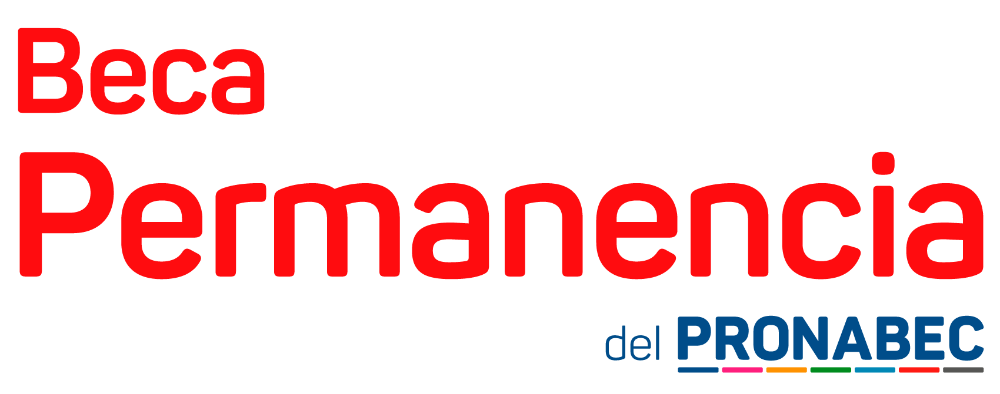

# 🎓 Simulador de Puntaje - Beca Permanencia 2025

Simulador interactivo de puntaje para postulantes a la **Beca Permanencia** de PRONABEC. Calcula tu puntaje estimado basándose en las bases oficiales de la convocatoria 2025.



## ✨ Características

- 🔍 **Búsqueda inteligente de universidades**: Sistema de autocompletado con 49 universidades públicas
- 🎯 **Cálculo preciso automático** según bases oficiales de PRONABEC
- 🔒 **Validación dinámica**: Previene errores limitando selecciones según puntos disponibles
- 📱 **Diseño responsive**: Adaptado para móviles, tablets y escritorio
- 🎨 **Interfaz moderna**: Diseño limpio con notificaciones animadas
- ⚡ **Tiempo real**: Actualización instantánea de límites y cálculos
- 📊 **Desglose detallado**: Muestra el puntaje por cada categoría

## 📊 Criterios de Evaluación (Bases Oficiales 2025)

### A. Perfil Académico (Máximo 50 puntos)
| Indicador | Puntaje |
|-----------|---------|
| 🥇 1er o 2do puesto | **50 pts** |
| 🏆 Décimo superior | **45 pts** |
| ⭐ Quinto superior | **40 pts** |
| ✨ Tercio superior | **35 pts** |
| 📚 Medio superior | **30 pts** |

### B. Características de la IES (Máximo 25 puntos)

**Clasificación de Universidades (P):**
- Grupo 1: 15 puntos
- Grupo 2: 10 puntos
- Grupo 3: 5 puntos

**Ratio de Selectividad (S):**
- Quintil 1: 10 puntos
- Quintil 2: 9 puntos
- Quintil 3: 8 puntos
- Quintil 4: 7 puntos
- Quintil 5: 0 puntos

**Fórmula:** B = P + S (máximo 25 puntos)

### C. Condiciones Priorizables (Máximo 25 puntos)

**Clasificación Socioeconómica:**
- ✅ Pobreza extrema (PE): **10 puntos**
- Quintil 5 (región): **10 puntos**

**Tasa de Interrupción Regional:**
- Quintil 4: 7 puntos
- Quintil 3: 5 puntos
- Quintil 2: 2 puntos
- Quintil 1: 0 puntos

**Otras Condiciones (5 pts c/u, máximo 5 selecciones):**
- 🦽 Discapacidad (D)
- 🚒 Bomberos activos e hijos de bomberos (B)
- 🤝 Voluntarios reconocidos por MIMP (V)
- 🌎 Comunidades nativas, campesinas o pueblo afroperuano (IA)
- 🎖️ Licenciados del Servicio Militar Voluntario (L)
- ⚠️ Población expuesta a metales pesados (PEM)
- 🕊️ Víctima de violencia 1980-2000 (RE)
- 🗺️ Ámbito del VRAEM (VR)
- 🌄 Zona del Huallaga (H)
- 👶 Orfandad - Ley N° 31405 (OR)
- 🏠 Desprotección familiar (DF)
- 💉 Agente Comunitario de Salud (ACS)

**Importante:** El sistema calcula automáticamente cuántas condiciones puedes seleccionar según los puntos ya asignados, garantizando que no excedas el máximo de 25 puntos en esta sección.

## 🚀 Cómo Usar

1. **Selecciona tu Universidad**: Escribe o busca tu universidad en el campo de búsqueda
2. **Rendimiento Académico**: Selecciona tu posición en el orden de mérito
3. **Pobreza Extrema**: Marca si aplica (según padrón SISFOH)
4. **Otras Condiciones**: Selecciona las que apliquen (máximo según puntos disponibles)
5. **Calcular**: Haz clic en el botón para ver tu puntaje estimado

### 📝 Orden Recomendado

1. Primero completa **Universidad** (obligatorio para calcular tasa regional)
2. Marca **Pobreza Extrema** si aplica
3. Luego selecciona **Otras Condiciones Priorizables** (el sistema te indicará el máximo permitido)

## 🎨 Tecnologías

- **HTML5**: Estructura semántica
- **CSS3**: Diseño moderno con gradientes y animaciones
- **JavaScript ES6+**: Lógica de validación y cálculo
- **Responsive Design**: Mobile-first approach

## 📂 Estructura del Proyecto

```
simulador-permanencia/
├── index.html              # Página principal
├── styles.css              # Estilos y diseño
├── script.js               # Lógica del simulador
├── assets/
│   ├── Beca-Permanencia-Logotipo.png
│   └── fondo.jpg
├── README.md               # Documentación
└── DATOS-CORRECTOS.md      # Datos oficiales de referencia
```

## ⚠️ Aviso Importante

**Este simulador es una herramienta de referencia no oficial.** El puntaje final será calculado por PRONABEC según la verificación de documentos y el cumplimiento de requisitos establecidos en las bases de la convocatoria.

## 📚 Referencias Oficiales

- [Beca Permanencia 2025 - PRONABEC](https://www.pronabec.gob.pe/beca-permanencia/)
- [Bases de la Convocatoria 2025](https://www.pronabec.gob.pe/beca-permanencia/#basespermanencia2025)

## 👨‍💻 Autor

Creado por [@kevin.pkrl](https://www.instagram.com/kevin.pkrl/)

## 📄 Licencia

Este proyecto es de código abierto y está disponible para uso educativo.

## 🤝 Contribuciones

Las contribuciones, reportes de bugs y sugerencias son bienvenidos. Si encuentras algún error en los datos o en el cálculo, por favor abre un issue.

---

**Versión:** 2.0  
**Última actualización:** Octubre 2025  
**Estado:** ✅ Actualizado con bases oficiales 2025
